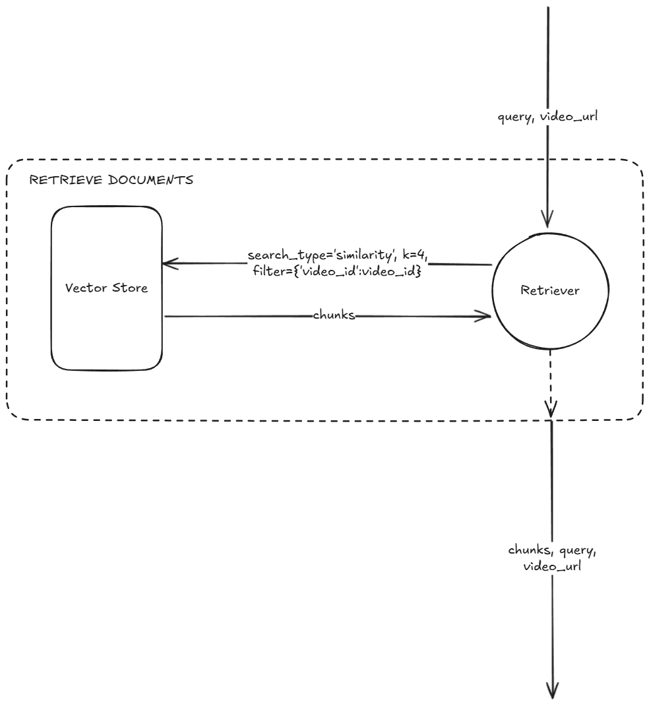
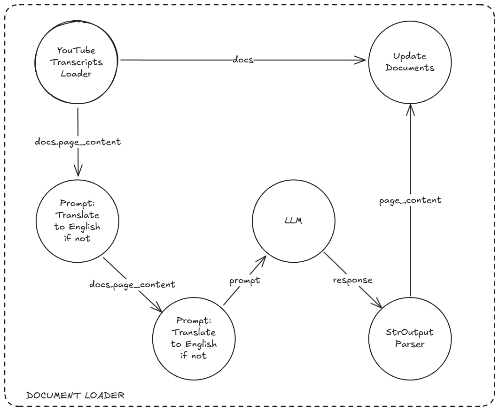
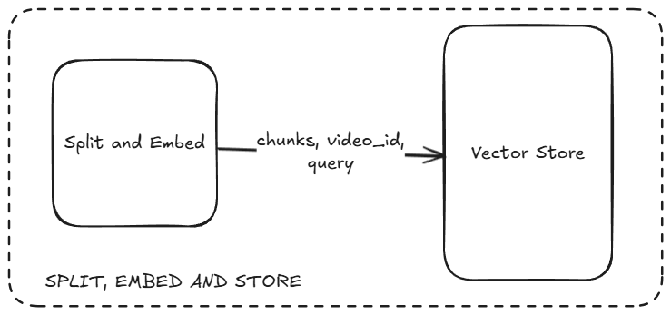
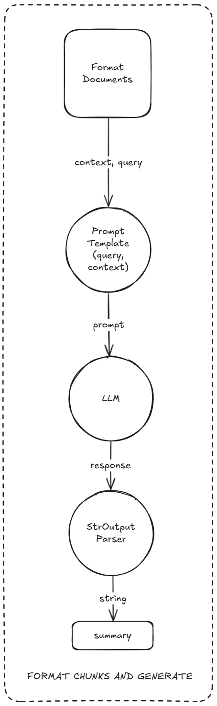
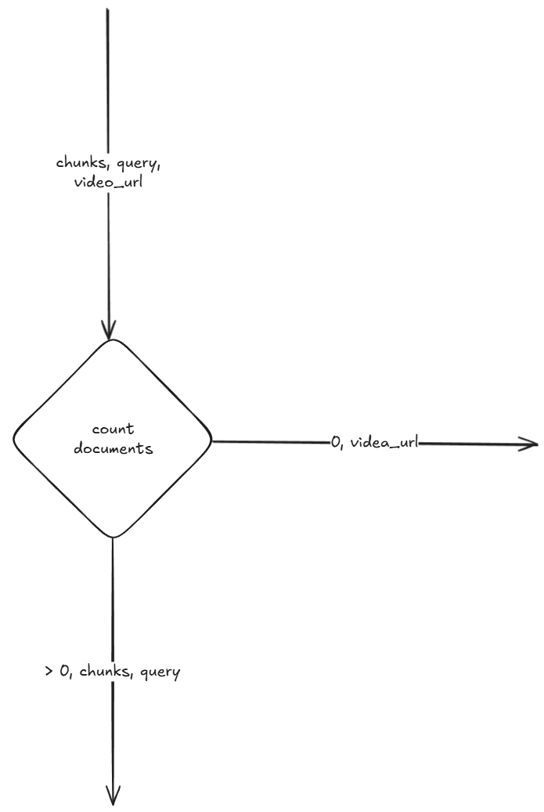
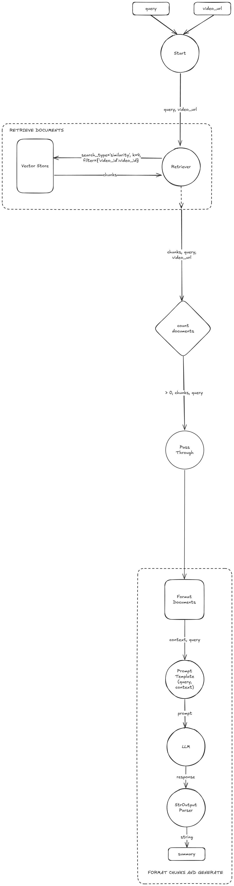
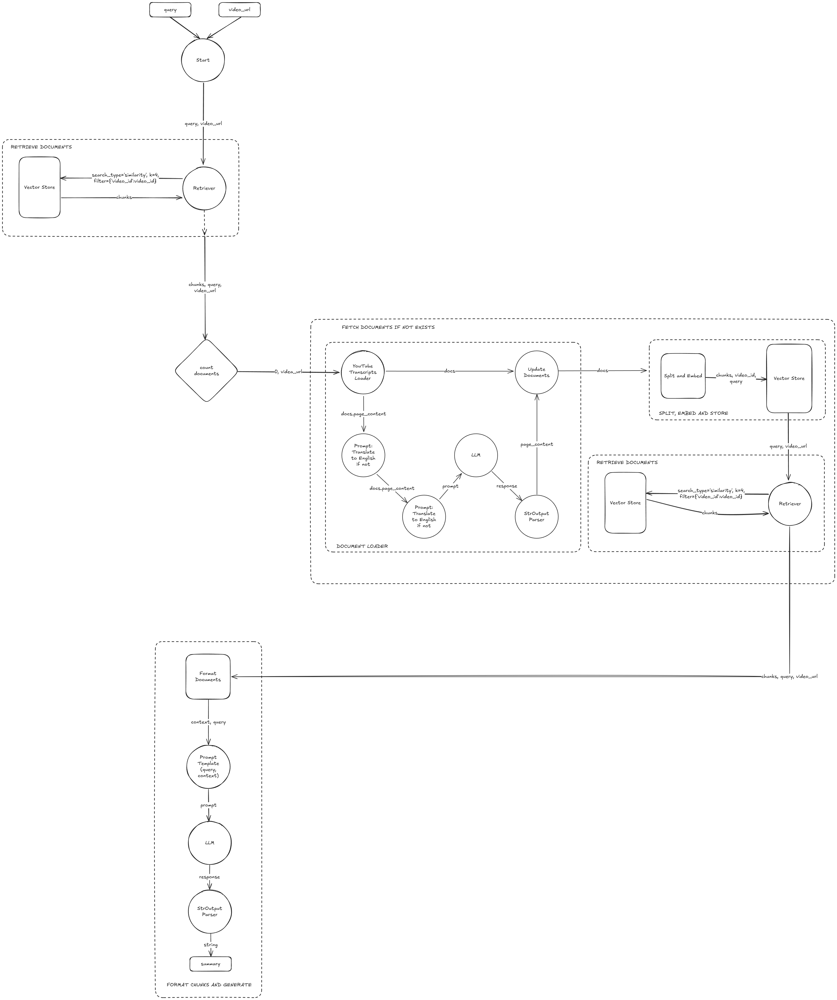

# YouTube Video Summarize
This is a small LangChan example project aimed to summarize YouTube Videos given their URL

---

## Features
- Get particular summary based on your input query
- Automatic translation to english
- Web UI to interact with

---

## Tech Stack
- LangChain
- Python
- Chroma
- Google Gemini
- ChatGPT
- Huggingface / Deepseek-r1

---

## Installation
The project's requirements are listed in `requirements.txt`

1. Create a python virtual environment
    ```bash
    python -m venv venv
    ```

2. Activate the environment:
    - Windows:
        ```bash
        ./venv/Scripts/activate.ps1
        ```
    - Linux/Mac/Git:
        ```bash
        source ./venv/Scripts/activate
        ```    
3. Install the requirements
    ```bash
    python -m pip install -r requirements.txt
    ```

4. Running the project
    - The WebUI:
        ```bash
        streamlit run main.py
        ```

    - The RAG example through CLI:
        ```bash
        python src/rag.py
        ```

---

## RAG Architecture
We're using LangChain to create simple chains to automate the process of fetching YouTube video transcripts, and then passing the required lines to LLMs (Google or ChatGPT or Huggingface) to generate response.
The full architecture workflow can be found in `docs/yt-rag.excalidraw`

---

## Chains used to implement RAG Architecture

### Retrieve Document Chain
<center>

</center>

The default search parameters are:
```json
{
    "search_type": "similarity",
    "k": 4,
    "filter": { "video_id": video_id }
}
```
Where `video_id` is inferred from the inputs

---

### Document Loader (with Translation capability)
<center>

</center>

The `YouTubeTranscriptsLoader` gets the `video_url` as input and loads the YouTube video transcripts to then later **Translate to English** if it needs to, which is performed through the PromptLLMChain and then the `docs` are updated via `Update Documents` logic (This isn't an actual runnable in code, but handled during combing transcripts and creating a `LangChain.Document` object). The translation is the most **token heavy** process of the whole workflow.
After updating documents it is sent to Text Splitter. 

---

### Text Splitter and Vector Store
<center>

</center>

The combined step to create embeddings and storing them to vector store.

---

### Format Documents and Generate
<center>

</center>

The `chunks` retrieved from store are formatted to form a paragraph, and then passed to LLM (of your choice) to generate a summary of the video as requested.
The prompts for any LLM are stored in `src/augmentation/augment_query.py`

---

## Data Flow

There are two ways the execution of this program can happen. The case is dependent on the existence of the Video transcripts in the vector database:
1. **The video transcripts are already present in the database** (`n_chunks > 0`)
2. **The video transcripts are *not* present in the database** (`n_chunks == 0`)

<center>

</center>

### Main Workflow (Case 1)

<center>

</center>

### Alternate Workflow (Case 2)

<center>

</center>


## Contributors
- Rakshit Rabugotra